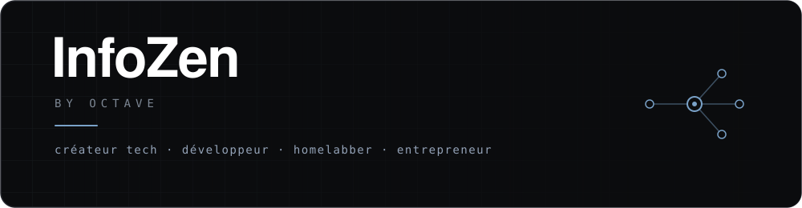
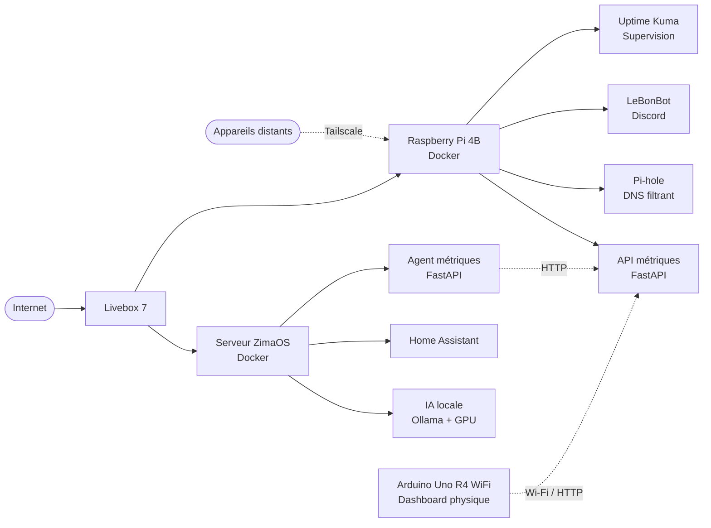

<div align="center">



<br>


</div>

## À propos

**InfoZen** est un univers dédié à la technologie : développement, réseaux,
hardware, infrastructure, automatisation et expérimentation.

L'objectif : rendre la technologie **simple, utile et maîtrisable**, en construisant
des outils concrets, en documentant les expériences et en faisant évoluer des
infrastructures réelles.

| Domaine | Ce qu'InfoZen développe |
| :--- | :--- |
| **Développement** | Applications, outils open source, API et solutions sur mesure |
| **Infrastructure** | Réseaux, serveurs, Docker, self-hosting et supervision |
| **Hardware** | Montage PC, diagnostic, optimisation et électronique |
| **Automatisation** | Scripts, bots, services et workflows |
| **IA locale** | Expérimentation et intégration de modèles auto-hébergés |
| **Création tech** | Astuces, tutoriels et contenu autour de l'informatique |

---

## Projets

### Klyr-optimizer

**Optimiseur PC Windows open source.**

- 44 optimisations réparties en 6 modules
- Monitoring matériel intégré
- 5 outils avancés
- 100 % local, sans télémétrie
- Interface française et anglaise

**Technologies :** `C#` · `WPF` · `.NET` · `Windows`

[Voir le dépôt →](https://github.com/InfoZen-git/Klyr-optimizer)

---

### Homelab

Le homelab InfoZen sert de laboratoire pour expérimenter les réseaux,
l'auto-hébergement, Docker, l'automatisation, la supervision et l'IA locale.



**Infrastructure :** 2 hôtes Docker · 7 services auto-hébergés · réseau local · accès distant sécurisé.

---

### InfoZen-Link

**NFC & solutions numériques pour les professionnels.**

Le projet relie un support physique à une expérience numérique grâce au NFC
et aux QR codes, avec l'objectif de proposer des solutions simples et utiles.

```text
Support physique
       ↓
   NFC / QR Code
       ↓
Expérience numérique
       ↓
      Action
```

---

### LeBonBot

Projet d'automatisation autour de la recherche, du traitement et de la
publication d'annonces, avec une logique orientée vers la réduction des tâches répétitives.

---

## Ce que j'utilise

<div align="center">


<br><br>


<br><br>


<br><br>

<sub>Ollama · Tailscale · Pi-hole · Uptime Kuma</sub>

</div>

---

## Architecture & infrastructure

```text
                         ┌─────────────────┐
                         │     INTERNET    │
                         └────────┬────────┘
                                  │
                         ┌────────▼────────┐
                         │    LIVEBOX 7    │
                         └────────┬────────┘
                                  │
                    ┌─────────────┴─────────────┐
                    │                           │
             ┌──────▼──────┐             ┌──────▼──────┐
             │   ZIMAOS    │             │ RASPBERRY PI│
             │    Docker   │             │    Docker   │
             └──────┬──────┘             └──────┬──────┘
                    │                           │
          ┌─────────┼─────────┐       ┌─────────┼─────────┐
          │         │         │       │         │         │
        IA       Home       API     DNS       Bot    Supervision
       locale  Assistant  métriques Pi-hole  Discord  Uptime Kuma

                         ╲       Tailscale       ╱
                          ╲──── accès distant ──╱
```

---

## Statistiques GitHub

<div align="center">


<br><br>


</div>

---

## Activité

<div align="center">


</div>

---

## Philosophie

<div align="center">

### Construire.
### Comprendre.
### Expérimenter.
### Améliorer.

</div>

InfoZen ne se limite pas à utiliser des technologies : l'objectif est de les
comprendre, de les tester dans des conditions réelles et de transformer les
expérimentations en projets utiles.

---

## L'écosystème InfoZen

```text
                         ┌─────────────┐
                         │   INFOZEN   │
                         └──────┬──────┘
                                │
          ┌─────────────────────┼─────────────────────┐
          │                     │                     │
          ▼                     ▼                     ▼
    DÉVELOPPEMENT         INFRASTRUCTURE           HARDWARE
          │                     │                     │
          ▼                     ▼                     ▼
     LOGICIEL & API           HOMELAB             MONTAGE PC
          │                     │                     │
          ▼                     ▼                     ▼
    AUTOMATISATION          SELF-HOSTING          ÉLECTRONIQUE
          │                     │                     │
          └─────────────────────┼─────────────────────┘
                                │
                                ▼
                           INNOVATION
```

---

## Où retrouver InfoZen

<div align="center">

[](https://infozen-git.github.io/portfolio.github.io/)
[](https://www.youtube.com/@LesAstucesdInfoZen)
[](https://www.tiktok.com/@infozen_off)
[](https://www.instagram.com/infozen_off)
[](https://discord.gg/infozen)

<br>

<sub>Une idée, une question ou un projet ? InfoZen est là pour construire des solutions utiles.</sub>

</div>

---

<div align="center">


</div>
