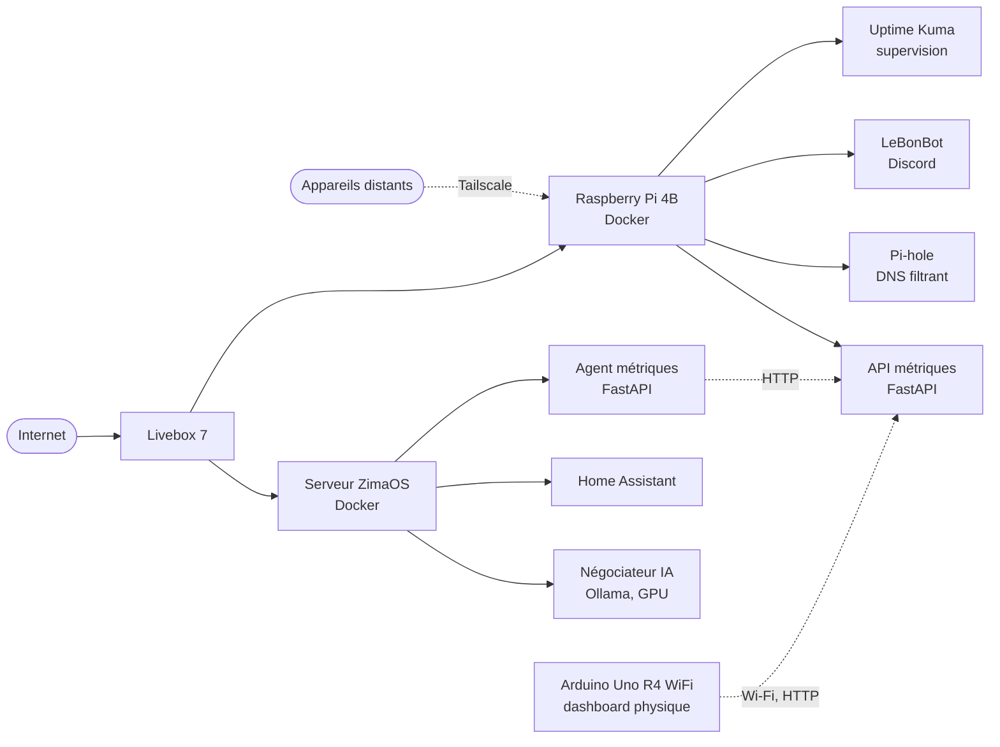

## À propos

Sous le nom **InfoZen**, je partage des astuces tech au quotidien,
je développe des outils open source, je fais tourner mon propre homelab et j'en tire des
activités bien réelles.

L'idée derrière tout ça : rendre la technologie simple, utile et un peu plus zen.

|  |  |
| :--- | :--- |
| **Créateur** | Formats courts sur TikTok et Instagram, tutos sur YouTube |
| **Développeur** | Outils open source et applications sur mesure |
| **Homelab** | Deux hôtes Docker, sept services auto-hébergés |
| **Entrepreneur** | Prestation, développement client, revente, produits locaux |

## Projets

### Klyr-optimizer

Optimiseur PC Windows open source, écrit en C# et WPF.

* 44 optimisations réparties en 6 modules
* Monitoring matériel intégré, plus 5 outils avancés
* 100 % local, aucune télémétrie
* Interface disponible en français et en anglais

**[Voir le dépôt](https://github.com/InfoZen-git/Klyr-optimizer)**

### Homelab

Mon terrain de jeu réseau à la maison, et la source de la moitié de mes idées.
Une Livebox 7 en tête de pont, un switch stacké pour la distribution, un TP-Link
Archer AX3000 en Wi-Fi 6, puis deux hôtes Docker qui font tourner l'ensemble.

## Ce que j'utilise

## Où me trouver

 

Une idée, une question, un projet ? Le Discord est ouvert, et beaucoup de choses y démarrent d'un simple message.
